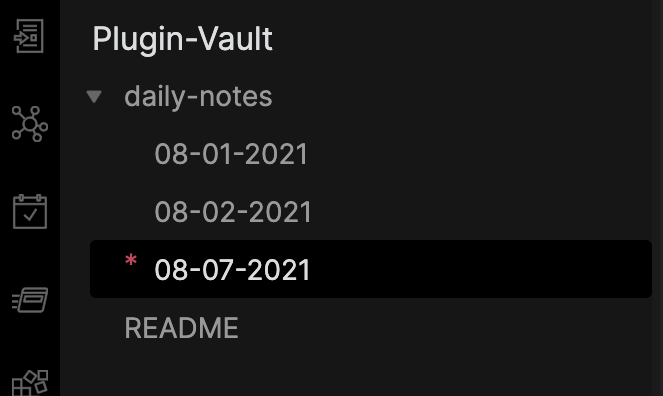

# Obsidian Daily Manager
This plugin is used to quickly add future todos.

## Using Once Installed

### 1: Setup within Obsidian
- Open `Settings`.
- Click `Options > Community Plugins` and make sure `Daily Manager` is enabled (toggled on).
- Click `Plugin Options > Daily Manager` to edit all your default options.

### 2: Plugin Options

#### 2a) Using Daily Notes Decals
It's happened to me many times that I want to see where in my `daily-notes` folder is today in relation to other daily notes. Toggling this on will update the navigator to show you.

As you can see, there is a red `*` by default. You can change this to be a different character(s), or even type in html such as `*`.

*Note:* The `Daily notes` plugin will let you set where your daily notes folder is stored. To use this plugin, you currently MUST put your folder at the root level of your vault, like in the image above. This plugin uses both `New file location` (directory where new files are created for via the `Daily notes` plugin), as well as `Date format` from the `Daily Notes` > `Plugin Options` to locate the element that needs a decal added. You do not need to use the `MM-DD-YYYY` format like I use in the above image.

### 3: Using Commands
Open the `Command Palette` (CMD+P by default on macOS) and start typing in `Daily Manager`. You will see a list of commands.

#### 3a) Daily Manager: Insert Todo
This is the bread and butter of adding new todos.

## Formats

Based on your `Daily Notes` settings, your format will be displayed the same when you use this plugin. When you type in dates, we use `chrono-node` for parsing, which by default uses **international English**. If you want a different format, this plugin isn't configured to do that at the moment. If an ambiguous date is given, such as Tuesday (ie which Tuesday?), and you don't specify, it will find the next occurrence of this (next Tuesday).

**User Input Format Examples**

| User Input  | Using Words    | Parsed Output | Notes |
|-------------|----------------|---------------|-------|
| `6/5/2020`  | June 5th 2020  | 06/05/2020    |       |
| `6/20/2020` | June 20th 2020 | 06/20/2020    |       |
| `20/6/2020` | June 20th 2020 | 06/20/2020    |       |
| `20/6/20`   | June 20th 2020 | 06/20/2020    |       |
| `6/20/20`   | June 20th 2020 | 06/20/2020    |       |
| `20/6`      | June 20th 2020 | 06/20/2022    | When writing this, it's `July 18, 2021`. Since I didn't specify a year, and the next June (future) is in 2022, it pushes to next year.|
| `20/8`      | August 20th 2020 | 08/20/2021    | When writing this, it's `July 18, 2021`. Since I didn't specify a year, and the next August (future) is in 2021, it Uses the current year.|
| `every 5 weeks on monday and friday until 5/25/22` | N/A | every 5 weeks on Monday, Friday until May 25, 2022 | You can even write in somewhat complex English sentences. Especially useful for recurring events |
| `tomorrow at 6pm` |
